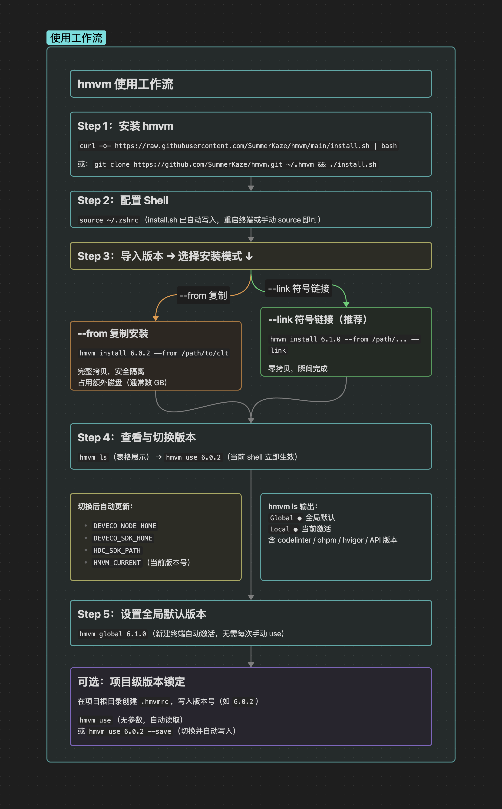

# hmvm - HarmonyOS Version Manager

> [中文](README.md) | English

A HarmonyOS development environment version management tool based on the [nvm](https://github.com/nvm-sh/nvm) architecture, designed for managing multiple versions of HarmonyOS command-line-tools.

**Why hmvm?** HarmonyOS development relies on the `command-line-tools` toolchain (ohpm, hvigor, hdc, etc.), and different projects often need to lock different versions. Manually editing environment variables is tedious and error-prone—hmvm handles multi-version switching with a single command, just like nvm for Node.js or fvm for Flutter.

## Features

- **Multi-version Management**: Install, switch, and uninstall different versions of HarmonyOS command-line-tools
- **Two Installation Modes**: Full copy (`--from`) or symbolic link (`--link`, zero-copy)
- **Version Information Table**: `hmvm list` displays codelinter / ohpm / hstack / hvigor / API versions
- **Automatic Environment Variables**: `hmvm use` automatically sets `DEVECO_NODE_HOME`, `DEVECO_SDK_HOME`, `HMVM_CURRENT`
- **Project Configuration**: Supports `.hmvmrc` to specify project-required versions
- **Aliases**: Supports aliases like `default`, automatically activated in new shells
- **Cross-platform**: Supports macOS / Linux (bash/zsh) and Windows (PowerShell 5.1+)

## Installation

### macOS / Linux

**One-line install (Recommended):**

```bash
curl -o- https://raw.githubusercontent.com/SummerKaze/hmvm/main/install.sh | bash
# or
wget -qO- https://raw.githubusercontent.com/SummerKaze/hmvm/main/install.sh | bash
```

**Install from Local Repository:**

```bash
git clone https://github.com/SummerKaze/hmvm.git ~/.hmvm
cd ~/.hmvm
./install.sh
```

The install script will write the source command to your shell profile (`~/.zshrc` or `~/.bashrc`). Restart your terminal or run `source ~/.zshrc` to apply changes.

### Windows (PowerShell 5.1+)

**One-line install (no admin rights required):**

```powershell
irm https://raw.githubusercontent.com/SummerKaze/hmvm/main/install.ps1 | iex
```

**Or install from a local repository:**

```powershell
git clone https://github.com/SummerKaze/hmvm.git $HOME\.hmvm
. "$HOME\.hmvm\install.ps1"
```

The install script will write the load instruction to your PowerShell profile (`$PROFILE`). Restart your terminal or run `. $PROFILE` to apply changes.

> **Windows Note**: The `--link` option on Windows uses an **NTFS Junction** (directory junction), which requires no admin privileges and behaves like a symbolic link on macOS/Linux. Uninstalling only removes the junction itself; the original directory is unaffected.

## Usage

### Workflow Overview



### Install command-line-tools Version

> **⚠️ Online download not yet supported** (TODO: Huawei account authentication, planned for future support).
> Currently, please use the following two local installation methods to import existing command-line-tools directories.

#### Method 1: Full Copy Installation

**Completely copies** the command-line-tools from the specified directory to the hmvm management directory. Safe and independent but occupies additional disk space.

```
$ hmvm install 6.1.0 --from /path/to/command-line-tools
Installing HarmonyOS command-line-tools v6.1.0 from /path/to/command-line-tools...
Installed HarmonyOS command-line-tools v6.1.0 successfully.
Now using HarmonyOS command-line-tools v6.1.0
```

#### Method 2: Symbolic Link Installation (Recommended, Zero-Copy)

Creates symbolic links directly, **without copying files**. Installation completes instantly, suitable for scenarios with existing DevEco Studio or standalone command-line-tools.

```
$ hmvm install 6.0.2 --from /path/to/command-line-tools_6.0.2 --link
Linking HarmonyOS command-line-tools v6.0.2 from /path/to/command-line-tools_6.0.2...
Linked HarmonyOS command-line-tools v6.0.2 successfully.
Now using HarmonyOS command-line-tools v6.0.2
```

> When uninstalling symlinked versions (`hmvm uninstall`), only the link itself is deleted, not affecting the original directory.

### View Installed Versions

```
$ hmvm ls
Cache directory:  /Users/h1007/GitHub/hmvm/versions/clt
Directory Size: 6.1G

┌─────────────┬────────────┬───────┬────────┬────────┬─────┬────────┬───────┐
│ Version     │ codelinter │ ohpm  │ hstack │ hvigor │ API │ Global │ Local │
├─────────────┼────────────┼───────┼────────┼────────┼─────┼────────┼───────┤
│ 6.0.2       │ 6.0.240    │ 6.0.1 │ 5.1.0  │ 6.22.3 │ 22  │        │ ●     │
├─────────────┼────────────┼───────┼────────┼────────┼─────┼────────┼───────┤
│ 6.1.0       │ 6.0.240    │ 6.1.1 │ 5.1.0  │ 6.23.2 │ 23  │ ●      │       │
└─────────────┴────────────┴───────┴────────┴────────┴─────┴────────┴───────┘
```

- **Global `●`**: Global default version set by `hmvm global` (auto-activated in new terminals)
- **Local `●`**: Version activated by `hmvm use` in the current shell

### Switch Versions

```bash
hmvm use 6.1.0             # Activate specified version (effective in current shell)
hmvm use default           # Activate version corresponding to default alias
hmvm use                   # Read .hmvmrc in current directory and auto-switch
hmvm use 6.1.0 --save      # Activate and write to .hmvmrc (project-level fixed version)
hmvm current               # View currently activated version
```

Toolchain version takes effect immediately after switching:

```
$ hmvm use 6.0.2
Now using HarmonyOS command-line-tools v6.0.2
$ hvigorw --version
6.22.3

$ hmvm use 6.1.0
Now using HarmonyOS command-line-tools v6.1.0
$ hvigorw --version
6.23.2
```

### Set Global Default Version (Auto-activated in New Shells)

```
$ hmvm global 6.1.0
default -> v6.1.0
Now using HarmonyOS command-line-tools v6.1.0
```

After setting, this version will be silently activated each time a new terminal is opened, no need for manual `hmvm use`. View current global version:

```
$ hmvm global
v6.1.0
```

### Use .hmvmrc Within Projects

Create `.hmvmrc` in the project root directory and write the version number:

```
6.1.0
```

After entering the project, run `hmvm use` (without arguments) to automatically switch according to `.hmvmrc`:

```bash
cd ~/my-harmony-project
hmvm use
# Now using HarmonyOS command-line-tools v6.1.0
```

### Uninstall Versions

```bash
hmvm uninstall 6.0.2
```

> For symlinked versions: only deletes the link, the original command-line-tools directory is not affected.

### Command Reference


| Command | Description |
|---------|-------------|
| `hmvm -V` / `hmvm --version` | Display hmvm version |
| `hmvm install <version> --from <path>` | Install from local path (copy) |
| `hmvm install <version> --from <path> --link` | Install from local path (symbolic link, zero-copy) |
| `hmvm global [<version>]` | Set or view global default version (auto-activated in new shells) |
| `hmvm use [<version>] [--save]` | Switch version (effective in current shell, no args reads .hmvmrc) |
| `hmvm list` / `hmvm ls` | List installed versions (table format) |
| `hmvm current` | Display currently activated version |
| `hmvm uninstall <version>` | Uninstall version |
| `hmvm alias <name> [<version>]` | Set / view / delete alias |
| `hmvm which [command]` | Display command path (default ohpm) |
| `hmvm ls-remote` | List available remote versions (requires versions.json configuration) |

## Directory Structure

Default path `~/.hmvm` on **macOS / Linux**, `$HOME\.hmvm` on **Windows**:

```
$HMVM_DIR/
├── hmvm.sh                       # macOS/Linux main script (sourced to shell profile)
├── hmvm.ps1                      # Windows main script (dot-sourced to $PROFILE)
├── install.sh                    # macOS/Linux install script
├── install.ps1                   # Windows install script
├── bash_completion               # macOS/Linux auto-completion
├── versions.json                 # Remote version configuration (optional)
├── versions/
│   └── clt/                      # command-line-tools version directory
│       ├── v6.1.0/               # Fully copied installed version
│       ├── v6.0.2 -> /path/...   # Symbolic link installed version (macOS/Linux)
│       ├── v6.0.2                # NTFS Junction installed version (Windows)
│       └── .meta_v6.0.2.txt      # Bypass metadata for symlinked/junction versions (auto-generated)
└── alias/                        # Version aliases
    └── default                   # Default version
```

## Environment Variables

| Variable | Description |
|----------|-------------|
| `HMVM_DIR` | hmvm installation directory, default `~/.hmvm` |
| `HMVM_CURRENT` | Currently activated version number (written by `hmvm use`) |
| `DEVECO_NODE_HOME` | Current version's `tool/node` path |
| `NODE_HOME` | Same as `DEVECO_NODE_HOME`, for `hvigor/bin/hvigorw` recognition |
| `DEVECO_SDK_HOME` | Current version's `sdk` path |
| `HDC_SDK_PATH` | HDC debugging toolchain path (`sdk/default/openharmony/toolchains`) |
| `HMVM_BIN` | Current version's `bin` directory path |

## Technical Notes

- **macOS / Linux**: Pure Shell implementation, POSIX compatible, supports bash, zsh
- **Windows**: PowerShell 5.1+ implementation, feature-aligned with the Shell version; `--link` uses NTFS Junction (no admin rights required)
- PATH management logic references nvm; version table display references fvm
- Symlinked / Junction versions store version information via bypass metadata files (`.meta_v*.txt`), `hmvm list` lazy-loads generation
- `hmvm use` writes to `$HMVM_CURRENT` environment variable, `hmvm current` reads directly, avoiding path inference failure issues

## Migrate Existing Configuration

If you have manually configured command-line-tools paths in `~/.zshrc`:

```bash
# Old configuration
export PATH=~/command-line-tools/bin:$PATH
export DEVECO_NODE_HOME=~/command-line-tools/tool/node
```

You can replace with hmvm management (auto-adds source command after install.sh):

```bash
# Import with --link, no need to copy files
hmvm install 6.1.0 --from ~/command-line-tools --link
hmvm global 6.1.0   # Set global default version, auto-activated in new shells
```

## Star History

[](https://star-history.com/#SummerKaze/hmvm&Date)

## TODO

- [ ] Online download installation (Huawei account authentication, planned for future support)

## License

MIT
